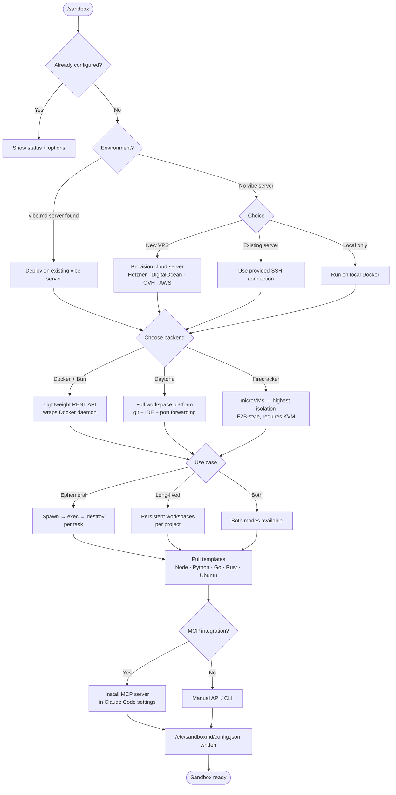

# 🧪 sandbox.md

Self-hosted cloud sandbox environment for Claude Code. One interview, one clean pass: choose your backend (Daytona, Docker+Bun, or Firecracker), your use case (ephemeral exec or long-lived workspaces), your templates, and your resource limits — then spawn isolated sandboxes from chat.

[](https://github.com/amajorai/sandbox.md)
[](https://github.com/amajorai/sandbox.md)
[](https://github.com/amajorai/sandbox.md)
[](https://github.com/amajorai/sandbox.md)
[](https://github.com/amajorai/sandbox.md/issues)

> [!NOTE]
> These skills have been built and tested with **Claude Code**. Codex support is untested. If you try them on Codex, we'd love your help. [Open an issue](https://github.com/amajorai/sandbox.md/issues) to share what works and what doesn't.

## Quickstart

```bash
npx skills add -g amajorai/sandbox.md
```

### Update

```bash
# Update this skill
npx skills update sandbox

# Update all installed skills (interactive scope prompt)
npx skills update

# Non-interactive (auto-detects scope)
npx skills update -y
```

### Claude Code plugin

```
/plugin marketplace add amajorai/sandbox.md
/plugin install sandboxmd@amajorai
```

Invoke as `/sandboxmd:sandbox`.

## Works great with

- 🪅 **[vibe.md](https://github.com/amajorai/vibe.md)** to provision the host server first — sandbox.md can deploy directly onto your existing vibe server.
- 📦 **[ship.md](https://github.com/amajorai/ship.md)** to build and ship features using your sandbox as the build environment — code in isolation, ship to production.
- 🎉 **[party.md](https://github.com/amajorai/party.md)** to run autonomous agents 24/7 inside sandboxes — each build gets a clean isolated environment.
- 🔎 **[fix.md](https://github.com/amajorai/fix.md)** to reproduce and debug bugs in a fresh sandbox — no polluted local state.
- 👻 **[spec.md](https://github.com/amajorai/spec.md)** to spec out what to build before spinning up a sandbox to build it.
- ⚡ **[amajorai/skills](https://github.com/amajorai/skills)** for hardening, CI, load testing, and 20+ more skills for your sandbox infrastructure.

## Skills

| Skill | When to use |
|-------|-------------|
| [`/sandbox`](skills/sandbox/SKILL.md) | **First-time setup.** Interviews you on backend, use case, templates, and resource limits — then deploys your self-hosted sandbox environment in one clean pass. Re-running on an already-configured server shows current state and offers next steps. |

## How it works



## Backends

| Backend | Isolation | Boot time | Best for |
|---------|-----------|-----------|----------|
| Docker + Bun | Container (namespace) | ~200ms | Most setups. Matches the vibe.md stack. |
| Daytona | Container + workspace layer | ~2s | Long-lived dev workspaces with git + IDE |
| Firecracker | microVM (kernel-level) | ~125ms | Highest security. Requires KVM. |

## Sandbox API

Once deployed, the sandbox API exposes:

| Method | Endpoint | Description |
|--------|----------|-------------|
| `GET` | `/health` | Health check |
| `GET` | `/sandboxes` | List active sandboxes |
| `POST` | `/sandbox` | Create a new sandbox |
| `GET` | `/sandbox/:id` | Get sandbox info |
| `POST` | `/sandbox/:id/exec` | Execute a command |
| `DELETE` | `/sandbox/:id` | Destroy a sandbox |

### Example: spawn and exec

```bash
# Create a Node.js sandbox
curl -X POST http://your-server:7842/sandbox \
  -H "Authorization: Bearer $SANDBOX_API_KEY" \
  -H "Content-Type: application/json" \
  -d '{"template": "node", "ttl": 300}'

# Run a command inside it
curl -X POST http://your-server:7842/sandbox/<id>/exec \
  -H "Authorization: Bearer $SANDBOX_API_KEY" \
  -H "Content-Type: application/json" \
  -d '{"cmd": "node -e \"console.log(process.version)\""}'

# Destroy it
curl -X DELETE http://your-server:7842/sandbox/<id> \
  -H "Authorization: Bearer $SANDBOX_API_KEY"
```

## MCP integration

With MCP enabled, Claude Code can spawn and exec sandboxes directly as tool calls — no manual API calls needed. Configure via `/etc/sandboxmd/config.json` during setup.

## Star History

<a href="https://www.star-history.com/#amajorai/sandbox.md&Date">
 <picture>
   <source media="(prefers-color-scheme: dark)" srcset="https://api.star-history.com/svg?repos=amajorai/sandbox.md&type=Date&theme=dark" />
   <source media="(prefers-color-scheme: light)" srcset="https://api.star-history.com/svg?repos=amajorai/sandbox.md&type=Date" />
   
 </picture>
</a>
